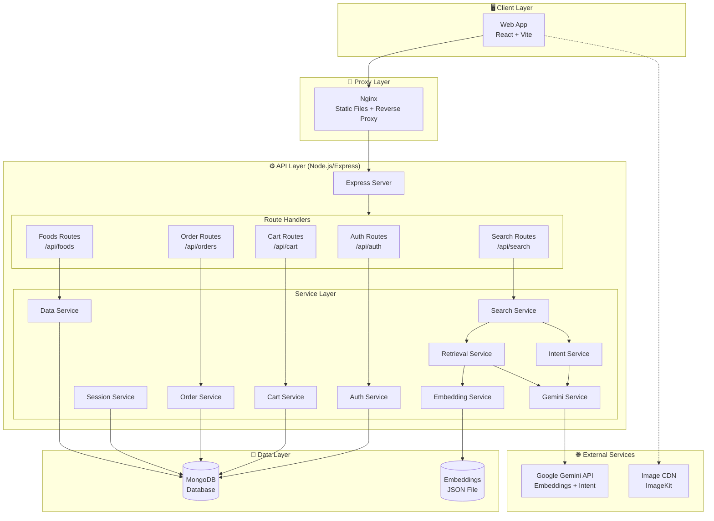
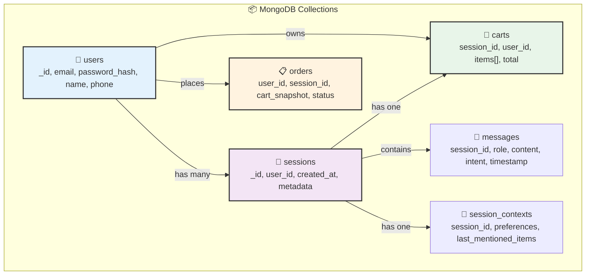
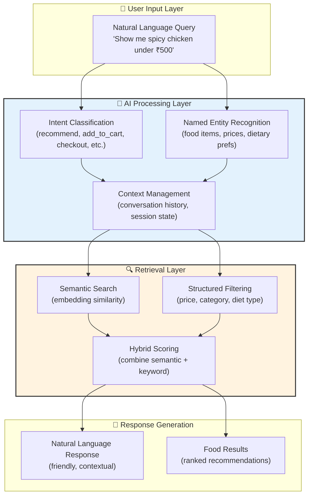
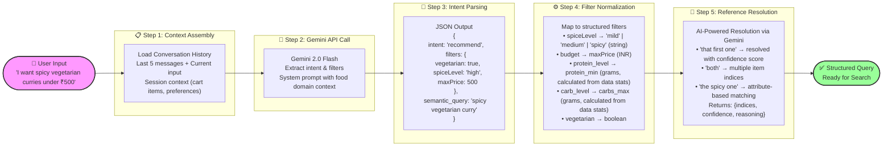
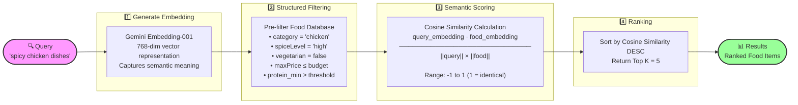
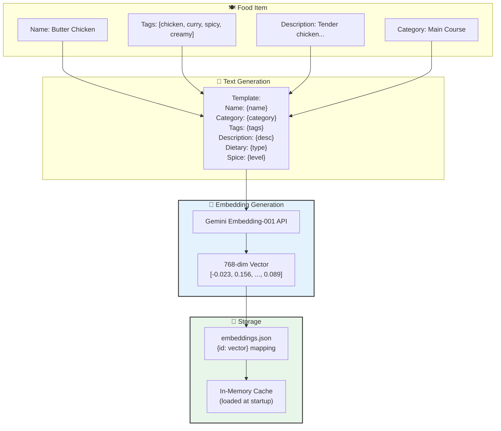
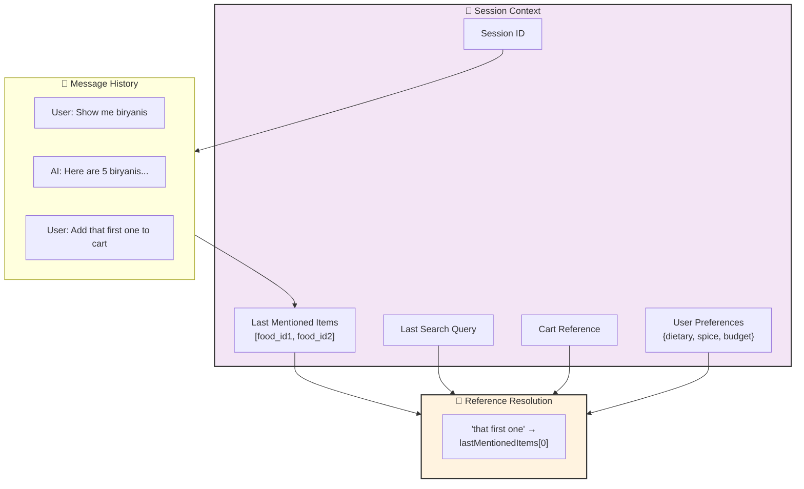
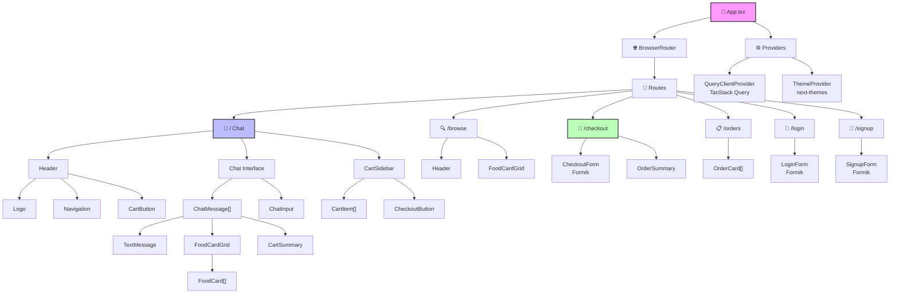
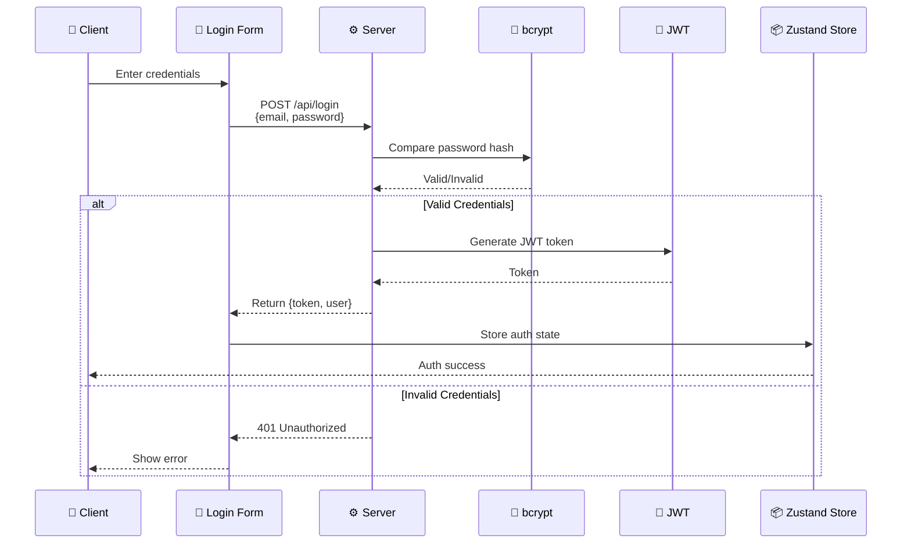
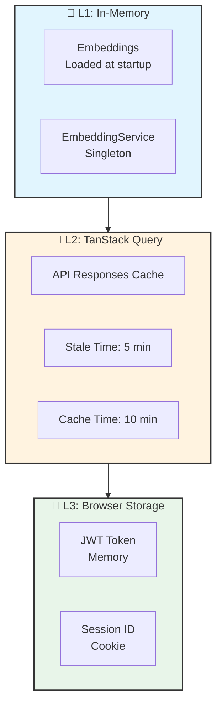

# AI-Powered Food Ordering System

An intelligent conversational food ordering platform with AI-powered recommendations, built with React, TypeScript, Node.js, and MongoDB.

## Quick Start (Docker Compose)

### 1. Create Environment Files

```bash
# Backend environment
cp backend/.env.example backend/.env

# Frontend environment
cp frontend/.env.example frontend/.env
```

Edit `backend/.env` and add your Gemini API key:
```env
GEMINI_API_KEY=your-gemini-api-key-here
```

### 2. Run with Docker Compose

```bash
docker compose up -d
```

The application will be available at:
- Frontend: http://localhost:3000
- Backend API: http://localhost:5200

### 3. Stop the Application

```bash
docker compose down
```

---

## Tech Stack & Libraries

### Backend Dependencies

| Library | Purpose | Version |
|---------|---------|---------|
| **Express.js** | Web framework for REST API | ^5.2.1 |
| **Mongoose** | MongoDB ODM for data modeling | ^9.2.1 |
| **@google/genai** | Google Gemini AI SDK for embeddings & chat | ^1.41.0 |
| **bcrypt** | Password hashing with salt | ^6.0.0 |
| **jsonwebtoken** | JWT token generation & verification | ^9.0.3 |
| **cors** | Cross-Origin Resource Sharing middleware | ^2.8.6 |
| **axios** | HTTP client for external API calls | ^1.13.5 |
| **imagekit** | Image CDN integration for food photos | ^6.0.0 |
| **env-cmd** | Environment variable management | ^11.0.0 |
| **TypeScript** | Type-safe JavaScript development | ^5.9.3 |

### Frontend Dependencies

| Library | Purpose | Version |
|---------|---------|---------|
| **React 19** | UI component library | ^19.2.0 |
| **React Router DOM** | Client-side routing | ^7.13.0 |
| **Vite** | Build tool & dev server | ^7.3.1 |
| **Tailwind CSS 4** | Utility-first CSS framework | ^4.1.18 |
| **Zustand** | Lightweight state management | ^5.0.11 |
| **TanStack Query** | Server state caching & synchronization | ^5.90.21 |
| **Formik** | Form handling & validation | ^2.4.9 |
| **Yup** | Schema validation for forms | ^1.7.1 |

### Infrastructure & DevOps

| Technology | Purpose |
|------------|---------|
| **Docker** | Containerization for consistent deployments |
| **Docker Compose** | Multi-container orchestration |
| **Nginx** | Reverse proxy & static file serving |
| **MongoDB** | NoSQL document database |
| **ImageKit CDN** | Image optimization & delivery |

---

## Technical Requirements Document (TRD)

### 1. System Architecture



### 2. Database Schema (MongoDB)

#### Collections

| Collection | Purpose | Key Fields |
|------------|---------|------------|
| **users** | Registered user accounts | `_id`, `email`, `password_hash`, `name`, `phone`, `created_at` |
| **sessions** | Conversation sessions | `_id`, `user_id` (nullable), `created_at`, `last_message_at`, `metadata` |
| **messages** | Chat history | `_id`, `session_id`, `role`, `content`, `intent`, `filters`, `results`, `timestamp` |
| **session_contexts** | Conversation state | `session_id`, `last_mentioned_items`, `last_search_query`, `preferences`, `cart_id`, `updated_at` |
| **carts** | Shopping carts | `_id`, `session_id`, `user_id`, `items[]`, `created_at`, `updated_at` |
| **orders** | Completed orders | `_id`, `user_id`, `session_id`, `cart_snapshot`, `customer_info`, `total`, `status`, `payment_method`, `created_at` |

#### Schema Relationships



#### Indexes

```javascript
// Performance indexes
db.users.createIndex({ email: 1 }, { unique: true });
db.sessions.createIndex({ user_id: 1 });
db.messages.createIndex({ session_id: 1, timestamp: -1 });
db.carts.createIndex({ session_id: 1 });
db.carts.createIndex({ user_id: 1 });
db.orders.createIndex({ user_id: 1, created_at: -1 });
```

### 3. AI/ML Architecture

The AI/ML layer is the core intelligence of the food ordering system, enabling natural language understanding, semantic search, and personalized recommendations. It combines Google's Gemini models with custom retrieval algorithms to deliver a conversational food discovery experience.

#### 3.1 System Overview



#### 3.2 Intent Extraction Flow

The system uses a multi-stage pipeline to understand user intent from natural language:



**Intent Types Supported:**

| Intent | Description | Example Query |
|--------|-------------|---------------|
| `recommend` | Suggest food items based on preferences | "Show me spicy biryanis" |
| `add_to_cart` | Add item(s) to shopping cart | "Add that biryani to my cart" |
| `details` | Request more information about a dish | "Tell me more about the butter chicken" |
| `checkout` | Proceed to order placement | "I'm ready to checkout" |
| `disambiguate` | Clarify ambiguous requests | "Add a pizza" (when multiple pizzas exist) |

**Additional Intent Fields:**

| Field | Purpose | Example |
|-------|---------|---------|
| `items` | Multiple named items for batch add | `["Grilled Chicken", "Caesar Salad"]` |
| `quantity` | Number of items to add | `2` for "add two pizzas" |
| `item_reference` | Reference to previously shown items | "that", "the first one", "both" |
| `message` | Dynamic response message for recommendations | "Here are delicious vegetarian options!" |
| `follow_up_question` | Suggest add-ons/sides | "Would you like drinks with that?" |
| `secondary_intent` | For compound requests | "add that AND show me naan" |
| `requires_disambiguation` | Flag when clarification needed | `true` when ambiguous without context |

#### 3.3 Hybrid Search Algorithm

The search system uses a two-stage approach: structured filtering followed by semantic ranking:



**Algorithm Details:**

```typescript
// Stage 1: Structured Filtering
let foods = getFoods();
foods = foods.filter(f => matchesCategory(f, filters.category));
foods = foods.filter(f => f.nutrition.protein >= filters.protein_min);
foods = foods.filter(f => f.nutrition.carbs <= filters.carbs_max);
foods = foods.filter(f => f.isVegetarian === filters.vegetarian);
foods = foods.filter(f => f.spiceLevel === filters.spiceLevel);
foods = foods.filter(f => f.price <= filters.maxPrice);

// Stage 2: Semantic Ranking (Pure Cosine Similarity)
const scoredFoods = foods.map(food => ({
  food,
  score: cosineSimilarity(queryEmbedding, foodEmbedding)
}));

// Sort and return top K
scoredFoods.sort((a, b) => b.score - a.score);
return scoredFoods.slice(0, topK);
```

**Fallback Search Methods:**

| Method | When Used | Approach |
|--------|-----------|----------|
| `hybridSearch` | Default | Structured filters + cosine similarity |
| `semanticOnlySearch` | When filters too restrictive | Cosine similarity only, no pre-filtering |
| `keywordSearch` | When embeddings unavailable | TF-IDF style keyword matching on name/category/description |

#### 3.4 Embedding Strategy

Food items are converted to vector embeddings for semantic search:



**Embedding Text Template:**
```
Food Item: {name}
Category: {category}
Cuisine: {cuisine}
Type: {vegetarian/non-vegetarian/vegan}
Spice Level: {1-5}/5
Tags: {tag1, tag2, tag3}
Description: {description}
Price: ₹{price}
Protein: {protein}g
```

#### 3.5 Context Management

The system maintains conversation context for multi-turn interactions:



**Context Persistence:**
- Session contexts stored in MongoDB (`session_contexts` collection)
- Last 5 messages included in intent extraction prompts
- Automatic cleanup of inactive sessions (configurable TTL)

#### 3.6 AI Models Configuration

| Model | Purpose | Configuration | Cost Optimization |
|-------|---------|---------------|-----------------|
| **gemini-embedding-001** | Text embeddings | 768 dimensions, float32 | Pre-computed at build time |
| **gemini-2.0-flash-exp** | Intent extraction | Default model settings | Response caching for common queries |
| **gemini-2.0-flash-exp** | Reference resolution | Default model settings | Only called when references detected |

**Model Selection Rationale:**
- **Flash-exp model**: Experimental flash model optimized for low latency (ideal for real-time chat)
- **Embedding-001**: Cost-effective, high-quality embeddings for semantic search
- **Pre-computed embeddings**: Generated at build time via `generate-embeddings.ts` script to avoid runtime API costs
- **Default settings**: Uses model defaults for temperature and tokens (not explicitly configured)

#### 3.7 Prompt Engineering

**Intent Extraction System Prompt:**
```
You are an AI intent extraction engine for a restaurant ordering system.

Available intents: recommend, add_to_cart, details, checkout, disambiguate

Extract these filters when present:
- category: string (biryani, curry, bread, dessert, etc.)
- protein_level: "high" | "medium" | "low" (mapped to grams based on data stats)
- carb_level: "high" | "medium" | "low" (mapped to grams based on data stats)
- vegetarian: boolean
- spiceLevel: "mild" | "medium" | "spicy"
- budget: numeric value in INR

Additional fields to extract:
- semantic_query: Core food preference query for embedding search
- item_reference: References like "that", "it", "the first one", "both"
- items: Array of named items for batch add (e.g., ["Grilled Chicken", "Caesar Salad"])
- quantity: Number when user says "add two pizzas"
- message: Friendly dynamic message for "recommend" intent
- follow_up_question: Suggest add-ons/sides for "recommend" intent
- requires_disambiguation: true when ambiguous without context
- secondary_intent: For compound requests like "add that AND show me naan"
- secondary_query: Additional search query for compound requests

Return STRICT JSON with ALL fields (set to null if not applicable).
```

**Few-Shot Examples:**

```json
// User: "I need something for lunch, chicken-based, high protein, low carb"
{
  "intent": "recommend",
  "filters": {
    "category": "chicken",
    "protein_level": "high",
    "carb_level": "low",
    "vegetarian": false,
    "spiceLevel": null,
    "budget": null
  },
  "semantic_query": "chicken high protein low carb lunch",
  "item_reference": null,
  "items": null,
  "quantity": null,
  "message": "Here are some delicious high-protein chicken dishes perfect for your lunch!",
  "follow_up_question": "Would you like to add any sides, salads, or drinks to complete your meal?",
  "requires_disambiguation": null,
  "secondary_intent": null,
  "secondary_query": null
}

// User: "Add two of those to my cart"
{
  "intent": "add_to_cart",
  "filters": {},
  "semantic_query": null,
  "item_reference": "those",
  "items": null,
  "quantity": 2,
  "message": null,
  "follow_up_question": null,
  "requires_disambiguation": null,
  "secondary_intent": null,
  "secondary_query": null
}

// User: "Add that biryani and show me some naan bread"
{
  "intent": "add_to_cart",
  "filters": {},
  "semantic_query": null,
  "item_reference": "that biryani",
  "items": null,
  "quantity": 1,
  "message": null,
  "follow_up_question": null,
  "requires_disambiguation": null,
  "secondary_intent": "recommend",
  "secondary_query": "naan bread"
}
```

### 4. API Design

#### 4.1 RESTful Endpoints

| Endpoint | Method | Auth | Description |
|----------|--------|------|-------------|
| `/api/health` | GET | No | Health check |
| `/api/auth/register` | POST | No | User registration |
| `/api/auth/login` | POST | No | User login |
| `/api/auth/me` | GET | Yes | Get current user |
| `/api/foods` | GET | No | Get all foods |
| `/api/foods/:id` | GET | No | Get food by ID |
| `/api/search` | POST | No | AI chat/search |
| `/api/search/:sessionId/history` | GET | No | Chat history |
| `/api/cart` | GET | No | Get cart |
| `/api/cart/items` | POST | No | Add to cart |
| `/api/cart/items/:id` | PUT | No | Update quantity |
| `/api/cart/items/:id` | DELETE | No | Remove item |
| `/api/cart` | DELETE | No | Clear cart |
| `/api/orders` | GET | Yes | Order history |
| `/api/orders` | POST | Yes | Create order |
| `/api/orders/:id` | GET | Yes | Order details |
| `/api/orders/:id/cancel` | POST | Yes | Cancel order |

#### 4.2 Request/Response Examples

**Search/Chat:**
```http
POST /api/search
Content-Type: application/json

{
  "message": "Show me spicy vegetarian curries",
  "sessionId": "optional-existing-session-id"
}

Response:
{
  "response": "Here are some spicy vegetarian curries!",
  "foods": [...],
  "sessionId": "sess_abc123",
  "intent": "recommend",
  "filters": { "vegetarian": true, "spiceLevel": "high" }
}
```

**Add to Cart:**
```http
POST /api/cart/items
Content-Type: application/json
Cookie: session_id=sess_abc123

{
  "foodId": "food_123",
  "quantity": 2
}

Response:
{
  "cart": {
    "id": "cart_456",
    "items": [...],
    "total": 798
  }
}
```

### 5. Frontend Architecture

#### 5.1 Component Hierarchy



#### 5.2 State Management

| Store | Technology | Purpose |
|-------|------------|---------|
| **Auth Store** | Zustand | User authentication state |
| **Cart Store** | Zustand | Shopping cart state |
| **Chat Store** | Zustand | Chat messages, session ID |
| **Server State** | TanStack Query | API data caching |

### 6. Security Architecture

#### 6.1 Authentication Flow



#### 6.2 Security Measures

| Layer | Implementation |
|-------|----------------|
| **Password Hashing** | bcrypt with salt rounds: 10 |
| **Token Signing** | JWT with HS256 algorithm |
| **Token Storage** | httpOnly cookies (backend) / memory (frontend) |
| **Session Management** | MongoDB-backed with UUID |
| **CORS** | Whitelist-based origins |
| **Input Validation** | Yup schemas on frontend, manual validation on backend |
| **NoSQL Injection** | Input sanitization and schema validation |

### 7. Performance Considerations

#### 7.1 Optimizations

| Area | Strategy | Implementation |
|------|----------|----------------|
| **Database** | Connection pooling | MongoDB native driver with connection pooling |
| **Search** | Pre-computed embeddings | JSON file caching |
| **Images** | CDN delivery | ImageKit integration |
| **Frontend** | Code splitting | Vite dynamic imports |
| **State** | Selective subscriptions | Zustand shallow equality |
| **API** | Response caching | TanStack Query stale-while-revalidate |

#### 7.2 Caching Strategy



### 8. Deployment Architecture

#### 8.1 Docker Configuration

```yaml
# docker-compose.yml
services:
  backend:
    build: ./backend
    ports: ["5200:5200"]
    env_file:
      - ./backend/.env
    restart: unless-stopped
      
  frontend:
    build: ./frontend
    ports: ["3000:80"]
    depends_on: [backend]
    restart: unless-stopped
```
