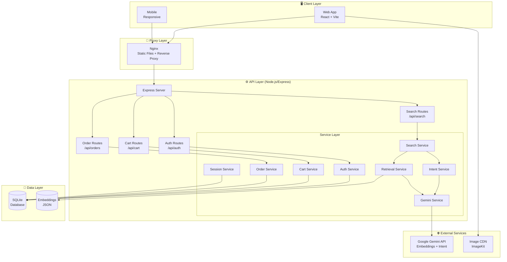
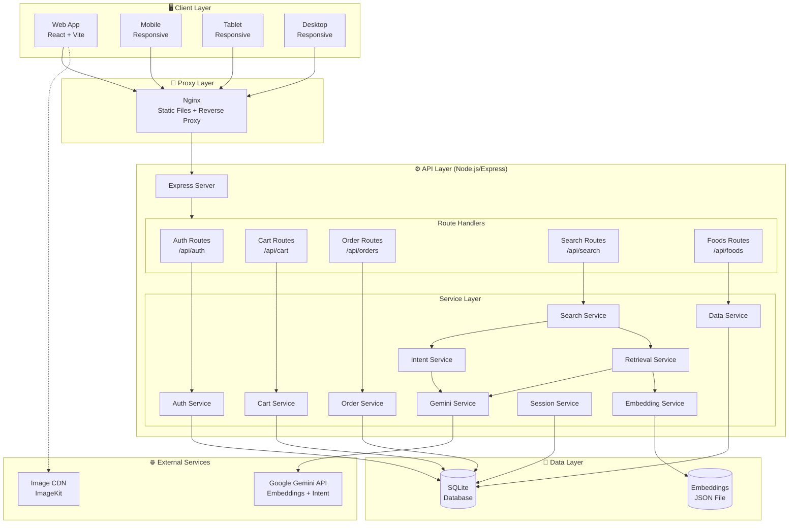
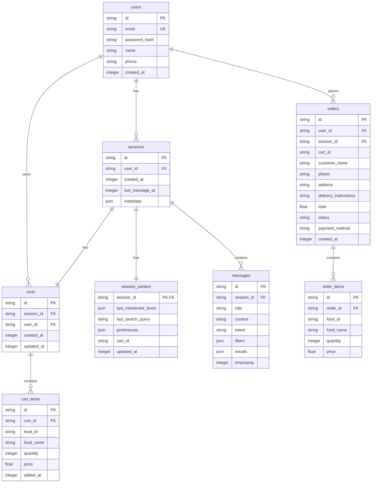
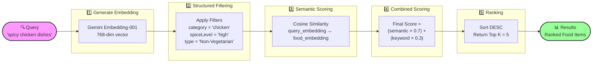
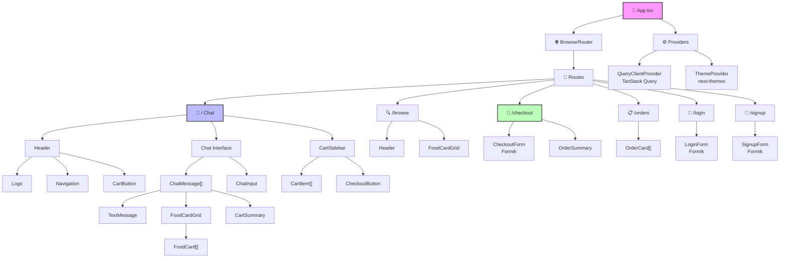
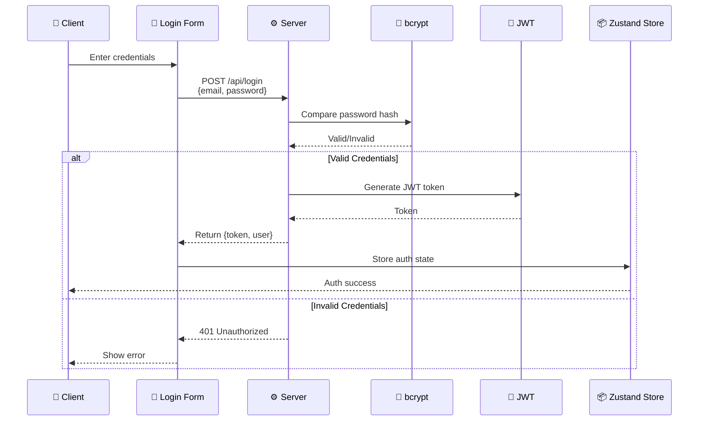
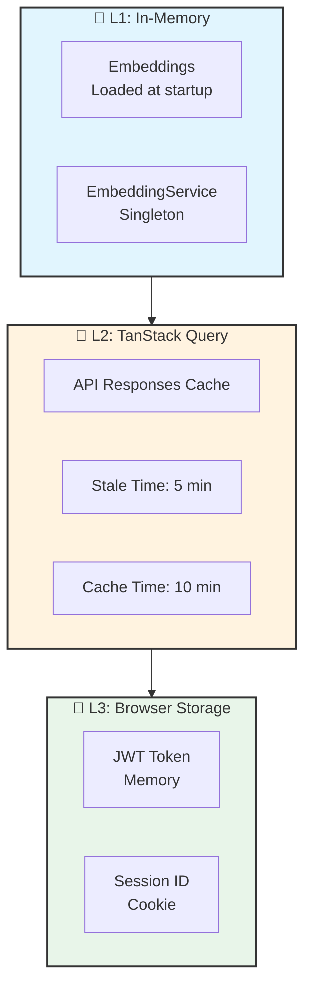

# SpiceRoute - AI-Powered Food Ordering System

An intelligent conversational food ordering platform with AI-powered recommendations, built with React, TypeScript, Node.js, and SQLite.




## Table of Contents

1. [Features](#features)
2. [Tech Stack](#tech-stack)
3. [Project Structure](#project-structure)
4. [Installation & Setup](#installation--setup)
5. [Technical Requirements Document (TRD)](#technical-requirements-document-trd)
6. [API Documentation](#api-documentation)
7. [Usage Guide](#usage-guide)
8. [Development](#development)
9. [Deployment](#deployment)
10. [Troubleshooting](#troubleshooting)
11. [Contributing](#contributing)
12. [License](#license)

## Features

### Core Features
- **AI-Powered Chat Interface**: Natural language food ordering with context-aware recommendations
- **Smart Food Recommendations**: Hybrid search combining semantic understanding with keyword matching
- **Guest & User Sessions**: Browse and order as guest, or create an account for order history
- **Real-time Cart Management**: Add, update, and remove items with persistent cart state
- **Secure Checkout**: Form-validated delivery information with order confirmation
- **Order History**: View past orders and track order status

### AI Capabilities
- **Intent Recognition**: Understands requests like "spicy vegetarian curries under ₹500"
- **Context Memory**: Remembers previous selections and preferences within a session
- **Smart Filters**: Automatically applies dietary, budget, and cuisine filters
- **Multi-turn Conversations**: Follow-up questions and refinement of recommendations

### Technical Highlights
- **JWT Authentication**: Secure user authentication with bcrypt password hashing
- **Session Management**: SQLite-backed sessions with automatic linking to user accounts
- **Responsive Design**: Mobile-first UI built with shadcn/ui components
- **Type Safety**: Full TypeScript implementation across frontend and backend
- **State Management**: Zustand for client state, TanStack Query for server state

## Tech Stack

### Frontend
| Technology | Version | Purpose |
|------------|---------|---------|
| React | 19.2.0 | UI Framework |
| TypeScript | 5.9.3 | Type Safety |
| Vite | 7.3.1 | Build Tool |
| Tailwind CSS | 4.1.18 | Styling |
| shadcn/ui | 3.8.4 | UI Components |
| Zustand | 5.0.11 | Client State Management |
| TanStack Query | 5.90.21 | Server State Management |
| React Router | 7.13.0 | Routing |
| Formik | 2.4.9 | Form Management |
| Yup | 1.7.1 | Form Validation |

### Backend
| Technology | Version | Purpose |
|------------|---------|---------|
| Node.js | 20.x | Runtime |
| Express | 5.2.1 | Web Framework |
| TypeScript | 5.9.3 | Type Safety |
| SQLite | 3.x | Database |
| better-sqlite3 | 12.6.2 | Database Driver |
| Google Gemini API | 1.41.0 | AI/ML |
| JWT | 9.0.3 | Authentication |
| bcrypt | 6.0.0 | Password Hashing |

### Infrastructure
| Technology | Purpose |
|------------|---------|
| Docker | Containerization |
| Docker Compose | Multi-container orchestration |
| Nginx | Reverse proxy & static file serving |

## Project Structure

```
ai-food-ordering/
├── backend/
│   ├── src/
│   │   ├── index.ts              # Server entry point
│   │   ├── config/               # Environment configuration
│   │   │   └── env.ts            # Environment variables
│   │   ├── data/                 # Food data and embeddings
│   │   │   ├── foods.json        # Food catalog (100+ items)
│   │   │   └── embeddings.json   # Pre-computed embeddings
│   │   ├── db/                   # Database schema
│   │   │   └── schema.sql        # SQLite schema
│   │   ├── middleware/           # Auth middleware
│   │   │   └── auth.middleware.ts
│   │   ├── routes/               # API routes
│   │   │   ├── auth.routes.ts    # Authentication endpoints
│   │   │   ├── cart.routes.ts    # Cart management
│   │   │   ├── foods.routes.ts   # Food catalog
│   │   │   ├── order.routes.ts   # Order creation & history
│   │   │   └── search.routes.ts  # AI search & chat
│   │   ├── services/             # Business logic
│   │   │   ├── auth.service.ts   # User authentication
│   │   │   ├── cart.service.ts   # Cart operations
│   │   │   ├── data.service.ts   # Food data management
│   │   │   ├── database.service.ts # Database operations
│   │   │   ├── embedding.service.ts # Vector embeddings
│   │   │   ├── filter-normalizer.ts # Filter processing
│   │   │   ├── gemini.service.ts  # Gemini API integration
│   │   │   ├── intent.service.ts  # AI intent extraction
│   │   │   ├── order.service.ts   # Order management
│   │   │   ├── reference-resolver.service.ts # Context resolution
│   │   │   ├── retrieval.service.ts # Hybrid search
│   │   │   └── session.service.ts   # Session management
│   │   ├── types/                # TypeScript types
│   │   │   ├── food.ts           # Food type definitions
│   │   │   └── search.ts         # Search type definitions
│   │   └── utils/                # Utility functions
│   │       ├── common.ts         # Common utilities
│   │       └── cosine.ts         # Cosine similarity
│   ├── package.json
│   ├── tsconfig.json
│   ├── Dockerfile
│   └── .env.example
├── frontend/
│   ├── src/
│   │   ├── api.ts                # API client with interceptors
│   │   ├── App.tsx               # Main app component
│   │   ├── components/           # UI components
│   │   │   ├── ui/               # shadcn/ui components
│   │   │   ├── CartSidebar.tsx   # Shopping cart drawer
│   │   │   ├── ChatInput.tsx     # Chat input component
│   │   │   ├── ChatMessage.tsx   # Chat message variants
│   │   │   ├── FoodCard.tsx      # Food display card
│   │   │   ├── FoodCardGrid.tsx  # Food grid layout
│   │   │   ├── Header.tsx        # App header
│   │   │   ├── Image.tsx         # Image component with CDN
│   │   │   └── ProtectedRoute.tsx # Auth route guard
│   │   ├── hooks/                # Custom React hooks
│   │   │   ├── useAuth.ts        # Authentication hooks
│   │   │   ├── useCartInit.ts    # Cart initialization
│   │   │   ├── useChat.ts        # Chat mutation hook
│   │   │   ├── useFoods.ts       # Food data hooks
│   │   │   └── useOrders.ts      # Order management hooks
│   │   ├── pages/                # Page components
│   │   │   ├── Browse.tsx        # Food browsing page
│   │   │   ├── Chat.tsx          # Main chat interface
│   │   │   ├── Checkout.tsx      # Checkout form
│   │   │   ├── Login.tsx         # Login page
│   │   │   ├── OrderConfirmation.tsx # Order success page
│   │   │   ├── OrderHistory.tsx  # Order history page
│   │   │   └── Signup.tsx        # Signup page
│   │   ├── stores/               # Zustand stores
│   │   │   ├── auth.ts           # Auth state
│   │   │   ├── cart.ts           # Cart state
│   │   │   └── chat.ts           # Chat state
│   │   ├── types/                # TypeScript types
│   │   │   └── index.ts
│   │   ├── lib/
│   │   │   └── utils.ts          # Utility functions
│   │   ├── providers.tsx         # Context providers
│   │   ├── index.css             # Global styles
│   │   └── main.tsx              # Entry point
│   ├── package.json
│   ├── tsconfig.json
│   ├── vite.config.ts
│   ├── Dockerfile
│   └── .env.example
├── docker-compose.yml
└── README.md
```

## Installation & Setup

### Prerequisites

Before you begin, ensure you have the following installed:

| Requirement | Version | Installation |
|-------------|---------|--------------|
| Node.js | 18+ | [Download](https://nodejs.org/) |
| npm or yarn | Latest | Included with Node.js |
| Docker (optional) | 20+ | [Download](https://docs.docker.com/get-docker/) |
| Docker Compose (optional) | 2+ | Included with Docker Desktop |
| Google Gemini API Key | - | [Get API Key](https://makersuite.google.com/app/apikey) |

### Method 1: Local Development Setup

#### Step 1: Clone the Repository

```bash
git clone <repository-url>
cd ai-food-ordering
```

#### Step 2: Backend Setup

```bash
# Navigate to backend directory
cd backend

# Install dependencies
npm install
# or
yarn install

# Copy environment variables
cp .env.example .env

# Edit .env file with your configuration
# Required: GEMINI_API_KEY
# Optional: Customize JWT_SECRET, PORT, etc.
```

**Backend Environment Variables:**

| Variable | Required | Default | Description |
|----------|----------|---------|-------------|
| `GEMINI_API_KEY` | Yes | - | Google Gemini API key |
| `EMBEDDING_MODEL` | No | gemini-embedding-001 | Embedding model name |
| `INTENT_MODEL` | No | models/gemini-2.0-flash | Intent extraction model |
| `IMAGE_CDN_URL` | No | - | Image CDN base URL |
| `PORT` | No | 5200 | Server port |
| `NODE_ENV` | No | development | Environment mode |
| `JWT_SECRET` | No | super-secret-jwt-key | JWT signing secret |

#### Step 3: Generate Food Embeddings (One-time Setup)

```bash
cd backend

# Generate embeddings for semantic search
npm run generate:embeddings
# or
npx tsx src/scripts/generate-embeddings.ts
```

This creates `embeddings.json` with vector representations of all food items for AI-powered search.

#### Step 4: Frontend Setup

```bash
# Navigate to frontend directory
cd frontend

# Install dependencies
npm install
# or
yarn install

# Copy environment variables
cp .env.example .env

# Default values work for local development
```

**Frontend Environment Variables:**

| Variable | Required | Default | Description |
|----------|----------|---------|-------------|
| `VITE_API_URL` | Yes | http://localhost:5200/api | Backend API URL |

#### Step 5: Start Development Servers

**Terminal 1 - Backend:**
```bash
cd backend
npm run dev
# Server runs on http://localhost:5200
```

**Terminal 2 - Frontend:**
```bash
cd frontend
npm run dev
# Application runs on http://localhost:5173
```

### Method 2: Docker Setup (Recommended for Quick Start)

#### Step 1: Clone and Configure

```bash
git clone <repository-url>
cd ai-food-ordering

# Create backend .env file
cp backend/.env.example backend/.env

# Edit backend/.env and add your GEMINI_API_KEY
```

#### Step 2: Start with Docker Compose

```bash
# Build and start all services
docker compose up --build

# Or run in detached mode
docker compose up -d --build
```

**Services:**
| Service | URL | Description |
|---------|-----|-------------|
| Frontend | http://localhost:3000 | React application |
| Backend API | http://localhost:5200 | Express API |
| Health Check | http://localhost:5200/health | API health status |

#### Step 3: Stop Services

```bash
# Stop and remove containers
docker compose down

# Stop and remove containers with volumes
docker compose down -v
```

### Method 3: Production Deployment

#### Environment Setup

```bash
# Backend .env
NODE_ENV=production
PORT=5200
JWT_SECRET=<strong-random-secret-min-32-chars>
GEMINI_API_KEY=<your-production-api-key>
EMBEDDING_MODEL=gemini-embedding-001
INTENT_MODEL=models/gemini-2.0-flash
```

```bash
# Frontend .env (build time)
VITE_API_URL=https://api.yourdomain.com/api
```

#### Build and Deploy

```bash
# Build backend
cd backend
npm install
npm run build
npm start

# Build frontend
cd frontend
npm install
npm run build
# Serve dist/ folder with nginx or similar
```

## Technical Requirements Document (TRD)

### 1. System Architecture

#### 1.1 High-Level Architecture



#### 1.2 Architecture Patterns

| Pattern | Implementation | Purpose |
|---------|----------------|---------|
| **Layered Architecture** | Routes → Services → Data | Separation of concerns |
| **Service Layer Pattern** | Business logic encapsulation | Reusable, testable code |
| **Repository Pattern** | DatabaseService singleton | Data access abstraction |
| **Singleton Pattern** | DatabaseService, Embeddings | Single instance management |
| **Strategy Pattern** | Intent extraction, Search | Pluggable algorithms |
| **Observer Pattern** | React hooks, Zustand stores | Reactive state updates |

### 2. Database Schema

#### 2.1 Entity Relationship Diagram



#### 2.2 Schema Details

| Table | Purpose | Key Fields |
|-------|---------|------------|
| **users** | Registered user accounts | id, email, password_hash, name, phone |
| **sessions** | Conversation sessions | id, user_id (nullable), created_at, metadata |
| **messages** | Chat history | id, session_id, role, content, intent, filters, results |
| **session_context** | Conversation state | session_id, last_mentioned_items, preferences |
| **carts** | Shopping carts | id, session_id, user_id, created_at, updated_at |
| **cart_items** | Cart contents | id, cart_id, food_id, food_name, quantity, price |
| **orders** | Completed orders | id, user_id, cart_id, customer info, total, status |
| **order_items** | Order line items | id, order_id, food_id, food_name, quantity, price |

#### 2.3 Indexes

```sql
-- Performance indexes
CREATE INDEX idx_sessions_user ON sessions(user_id);
CREATE INDEX idx_carts_user ON carts(user_id);
CREATE INDEX idx_messages_session ON messages(session_id);
CREATE INDEX idx_cart_items_cart ON cart_items(cart_id);
CREATE INDEX idx_order_items_order ON order_items(order_id);
```

### 3. AI/ML Architecture

#### 3.1 Intent Extraction Flow

```mermaid
flowchart LR
    A(["👤 User Input<br/>'I want spicy vegetarian curries under ₹500'"]) --> B
    
    subgraph Step1["📋 Step 1: Context Assembly"]
        B["Load Conversation History<br/>Last 5 messages + Current input"]
    end
    
    B --> C
    
    subgraph Step2["🤖 Step 2: Gemini API Call"]
        C["Gemini 2.0 Flash<br/>Extract intent & filters"]
    end
    
    C --> D
    
    subgraph Step3["📄 Step 3: Intent Parsing"]
        D["JSON Output<br/>intent: recommend<br/>filters: {...}<br/>semantic_query: ..."]
    end
    
    D --> E
    
    subgraph Step4["⚙️ Step 4: Filter Normalization"]
        E["Map to structured filters<br/>spiceLevel → numeric<br/>budget → maxPrice<br/>protein_level → protein_min"]
    end
    
    E --> F
    
    subgraph Step5["🎯 Step 5: Reference Resolution"]
        F["Resolve 'that', 'it'<br/>→ specific food items"]
    end
    
    F --> G(["✅ Structured Query<br/>Ready for Search"])
    
    style A fill:#f9f,stroke:#333,stroke-width:2px
    style G fill:#9f9,stroke:#333,stroke-width:2px
```



#### 3.2 Hybrid Search Algorithm



#### 3.3 AI Models Configuration

| Model | Purpose | Parameters |
|-------|---------|------------|
| **gemini-embedding-001** | Text embeddings | 768 dimensions |
| **gemini-2.0-flash** | Intent extraction | Temperature: 0.1, Max tokens: 1024 |

### 4. API Design

#### 4.1 RESTful Endpoints

| Endpoint | Method | Auth | Description |
|----------|--------|------|-------------|
| `/api/health` | GET | No | Health check |
| `/api/auth/register` | POST | No | User registration |
| `/api/auth/login` | POST | No | User login |
| `/api/auth/me` | GET | Yes | Get current user |
| `/api/foods` | GET | No | Get all foods |
| `/api/foods/:id` | GET | No | Get food by ID |
| `/api/search` | POST | No | AI chat/search |
| `/api/search/:sessionId/history` | GET | No | Chat history |
| `/api/cart` | GET | No | Get cart |
| `/api/cart/items` | POST | No | Add to cart |
| `/api/cart/items/:id` | PUT | No | Update quantity |
| `/api/cart/items/:id` | DELETE | No | Remove item |
| `/api/cart` | DELETE | No | Clear cart |
| `/api/orders` | GET | Yes | Order history |
| `/api/orders` | POST | Yes | Create order |
| `/api/orders/:id` | GET | Yes | Order details |
| `/api/orders/:id/cancel` | POST | Yes | Cancel order |

#### 4.2 Request/Response Examples

**Search/Chat:**
```http
POST /api/search
Content-Type: application/json

{
  "message": "Show me spicy vegetarian curries",
  "sessionId": "optional-existing-session-id"
}

Response:
{
  "response": "Here are some spicy vegetarian curries!",
  "foods": [...],
  "sessionId": "sess_abc123",
  "intent": "recommend",
  "filters": { "vegetarian": true, "spiceLevel": "high" }
}
```

**Add to Cart:**
```http
POST /api/cart/items
Content-Type: application/json
Cookie: session_id=sess_abc123

{
  "foodId": "food_123",
  "quantity": 2
}

Response:
{
  "cart": {
    "id": "cart_456",
    "items": [...],
    "total": 798
  }
}
```

### 5. Frontend Architecture

#### 5.1 Component Hierarchy



#### 5.2 State Management

| Store | Technology | Purpose |
|-------|------------|---------|
| **Auth Store** | Zustand | User authentication state |
| **Cart Store** | Zustand | Shopping cart state |
| **Chat Store** | Zustand | Chat messages, session ID |
| **Server State** | TanStack Query | API data caching |

#### 5.3 Custom Hooks

| Hook | Purpose |
|------|---------|
| `useAuth` | Authentication operations |
| `useChat` | Chat mutations |
| `useCartInit` | Cart initialization |
| `useFoods` | Food data fetching |
| `useOrders` | Order management |

### 6. Security Architecture

#### 6.1 Authentication Flow



#### 6.2 Security Measures

| Layer | Implementation |
|-------|----------------|
| **Password Hashing** | bcrypt with salt rounds: 10 |
| **Token Signing** | JWT with HS256 algorithm |
| **Token Storage** | httpOnly cookies (backend) / memory (frontend) |
| **Session Management** | SQLite-backed with UUID |
| **CORS** | Whitelist-based origins |
| **Input Validation** | Yup schemas on frontend, manual validation on backend |
| **SQL Injection** | Parameterized queries via better-sqlite3 |

### 7. Performance Considerations

#### 7.1 Optimizations

| Area | Strategy | Implementation |
|------|----------|----------------|
| **Database** | Connection pooling | better-sqlite3 persistent connection |
| **Search** | Pre-computed embeddings | JSON file caching |
| **Images** | CDN delivery | ImageKit integration |
| **Frontend** | Code splitting | Vite dynamic imports |
| **State** | Selective subscriptions | Zustand shallow equality |
| **API** | Response caching | TanStack Query stale-while-revalidate |

#### 7.2 Caching Strategy



### 8. Deployment Architecture

#### 8.1 Docker Configuration

```yaml
# docker-compose.yml
services:
  backend:
    build: ./backend
    ports: ["5200:5200"]
    volumes:
      - sqlite_data:/app/backend  # Persistent database
    environment:
      - NODE_ENV=production
      
  frontend:
    build: ./frontend
    ports: ["3000:80"]
    depends_on: [backend]
    
volumes:
  sqlite_data:  # Named volume for data persistence
```

#### 8.2 Production Checklist

- [ ] Set strong JWT_SECRET (min 32 chars)
- [ ] Use production Gemini API key
- [ ] Enable HTTPS
- [ ] Configure proper CORS origins
- [ ] Set up log rotation
- [ ] Configure backup for SQLite database
- [ ] Set up monitoring/health checks

## API Documentation

### Authentication Endpoints

#### POST /api/auth/register
Create a new user account.

**Request:**
```json
{
  "email": "user@example.com",
  "password": "securepassword123",
  "name": "John Doe",
  "phone": "+91 9876543210"
}
```

**Response:**
```json
{
  "user": {
    "id": "usr_abc123",
    "email": "user@example.com",
    "name": "John Doe",
    "phone": "+91 9876543210"
  },
  "token": "eyJhbGciOiJIUzI1NiIs..."
}
```

#### POST /api/auth/login
Authenticate and receive JWT token.

**Request:**
```json
{
  "email": "user@example.com",
  "password": "securepassword123"
}
```

#### GET /api/auth/me
Get current authenticated user (requires JWT).

### Chat & Search Endpoints

#### POST /api/search
Send a message to the AI assistant.

**Request:**
```json
{
  "message": "Show me vegetarian curries under ₹500",
  "sessionId": "optional-existing-session"
}
```

**Response:**
```json
{
  "response": "Here are some great vegetarian curries!",
  "foods": [
    {
      "id": "food_123",
      "name": "Paneer Butter Masala",
      "description": "Creamy tomato curry with paneer",
      "price": 399,
      "image_url": "...",
      "nutrition": { "calories": 450, "protein": 18, "carbs": 22, "fat": 28 }
    }
  ],
  "sessionId": "sess_xyz789",
  "intent": "recommend",
  "filters": { "vegetarian": true, "maxPrice": 500 }
}
```

#### GET /api/search/:sessionId/history
Get chat history for a session.

### Cart Endpoints

#### GET /api/cart
Get current cart contents (requires session cookie).

#### POST /api/cart/items
Add item to cart.

**Request:**
```json
{
  "foodId": "food_123",
  "quantity": 2
}
```

#### PUT /api/cart/items/:itemId
Update item quantity.

#### DELETE /api/cart/items/:itemId
Remove item from cart.

### Order Endpoints

#### GET /api/orders
Get order history (authenticated).

#### POST /api/orders
Create order from cart (authenticated).

**Request:**
```json
{
  "deliveryInfo": {
    "name": "John Doe",
    "phone": "+91 9876543210",
    "address": "123 Main St, City",
    "deliveryInstructions": "Ring doorbell"
  }
}
```

## Usage Guide

### As a Guest

1. Visit the chat page at `/`
2. Start chatting with the AI assistant (e.g., "Show me vegetarian curries")
3. Add recommended items to cart using the "Add to Cart" buttons
4. Click the cart icon to review items
5. Proceed to checkout (login/signup required to complete order)

### As a Registered User

1. Sign up at `/signup` with email, name, phone, and password
2. Login at `/login` to access full features
3. Chat with AI for personalized recommendations
4. Add items to cart
5. Proceed to checkout with saved delivery info
6. View order history at `/orders`

### Example Chat Queries

| Query | Expected Response |
|-------|-------------------|
| "Show me some spicy appetizers under ₹300" | Filtered food cards |
| "I want high protein non-vegetarian dishes" | Protein-rich options |
| "Recommend something for 4 people around ₹1000" | Family-sized portions |
| "Add 2 Butter Chicken and 1 Garlic Naan to cart" | Cart update confirmation |
| "What are your popular desserts?" | Dessert category items |
| "Tell me more about the first one" | Item details |

## Development

### Adding New Food Items

1. Edit `backend/src/data/foods.json`
2. Add new food item following the existing schema:
```json
{
  "id": "food_unique_id",
  "name": "Food Name",
  "description": "Description",
  "category": "Category",
  "type": "Vegetarian|Non-Vegetarian",
  "spiceLevel": "Low|Medium|High",
  "ingredients": ["ingredient1", "ingredient2"],
  "nutrition": { "calories": 0, "protein": 0, "carbs": 0, "fat": 0 },
  "price": 0,
  "serves": 1,
  "image_url": "https://..."
}
```
3. Run `npm run generate:embeddings` in backend
4. Restart backend server

### Customizing the AI

Modify the system prompt in `backend/src/services/intent.service.ts` to change AI behavior:

```typescript
const prompt = `
You are an AI intent extraction engine for a restaurant ordering system.
[Customize this prompt to change personality, tone, or capabilities]
`;
```

### Frontend Component Development

The project uses shadcn/ui. Add new components:

```bash
cd frontend
npx shadcn add <component-name>
```

Available components: button, card, input, select, dialog, sheet, etc.

### Running Tests

```bash
# Backend tests (if implemented)
cd backend
npm test

# Frontend tests (if implemented)
cd frontend
npm test
```

### Code Quality

```bash
# Lint frontend
cd frontend
npm run lint

# Type check backend
cd backend
npx tsc --noEmit
```

## Deployment

### Environment Variables for Production

**Backend (.env):**
```
NODE_ENV=production
PORT=5200
JWT_SECRET=<strong-random-secret-min-32-characters>
GEMINI_API_KEY=<your-production-api-key>
EMBEDDING_MODEL=gemini-embedding-001
INTENT_MODEL=models/gemini-2.0-flash
IMAGE_CDN_URL=https://your-cdn.com/
```

**Frontend (.env):**
```
VITE_API_URL=https://api.yourdomain.com/api
```

### Docker Deployment

```bash
# Production build
docker compose -f docker-compose.yml up -d --build

# View logs
docker compose logs -f

# Scale backend (if using multiple instances)
docker compose up -d --scale backend=3
```

### Manual Deployment

**Backend:**
```bash
cd backend
npm install
npm run build
npm start  # Uses dist/index.js
```

**Frontend:**
```bash
cd frontend
npm install
npm run build
# Serve dist/ folder with nginx
```

### Nginx Configuration

```nginx
server {
    listen 80;
    server_name yourdomain.com;
    
    location / {
        root /path/to/frontend/dist;
        try_files $uri $uri/ /index.html;
    }
    
    location /api {
        proxy_pass http://localhost:5200;
        proxy_http_version 1.1;
        proxy_set_header Upgrade $http_upgrade;
        proxy_set_header Connection 'upgrade';
        proxy_set_header Host $host;
        proxy_cache_bypass $http_upgrade;
    }
}
```

## Troubleshooting

### Common Issues

#### Issue: "GEMINI_API_KEY is not defined"
**Solution:**
```bash
cd backend
cp .env.example .env
# Edit .env and add your GEMINI_API_KEY
```

#### Issue: "Cannot find module 'better-sqlite3'"
**Solution:**
```bash
cd backend
rm -rf node_modules
npm install
# On macOS with Apple Silicon, you may need:
npm rebuild better-sqlite3
```

#### Issue: "Port 5200 is already in use"
**Solution:**
```bash
# Find and kill process
lsof -ti:5200 | xargs kill -9
# Or change port in .env
PORT=5201
```

#### Issue: "No embeddings found"
**Solution:**
```bash
cd backend
npm run generate:embeddings
```

#### Issue: "CORS error in browser"
**Solution:**
Check that `CORS_ORIGINS` in backend includes your frontend URL:
```env
CORS_ORIGINS=http://localhost:5173,http://localhost:3000
```

#### Issue: Docker container exits immediately
**Solution:**
```bash
# Check logs
docker compose logs backend

# Ensure .env file exists
cat backend/.env | grep GEMINI_API_KEY

# Rebuild without cache
docker compose down -v
docker compose up --build
```

#### Issue: "JWT token expired"
**Solution:**
- Clear browser cookies
- Login again
- Check JWT_SECRET is consistent between restarts

### Debug Mode

Enable verbose logging:

```bash
# Backend
debug=true npm run dev

# Or set in .env
DEBUG=*
```

### Getting Help

1. Check application logs
2. Verify environment variables
3. Test API health: `curl http://localhost:5200/health`
4. Review browser console for frontend errors
5. Check Docker container status: `docker compose ps`