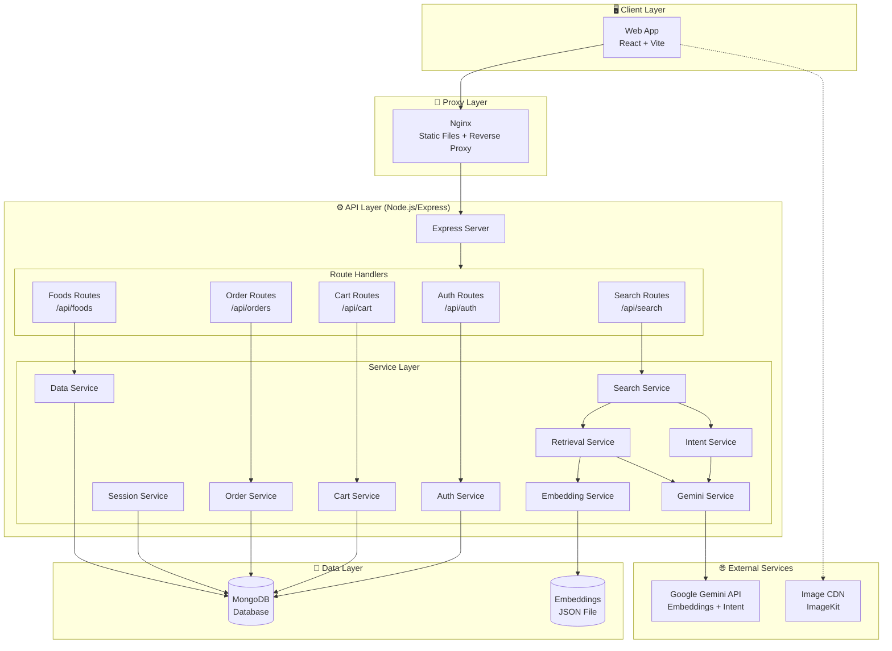
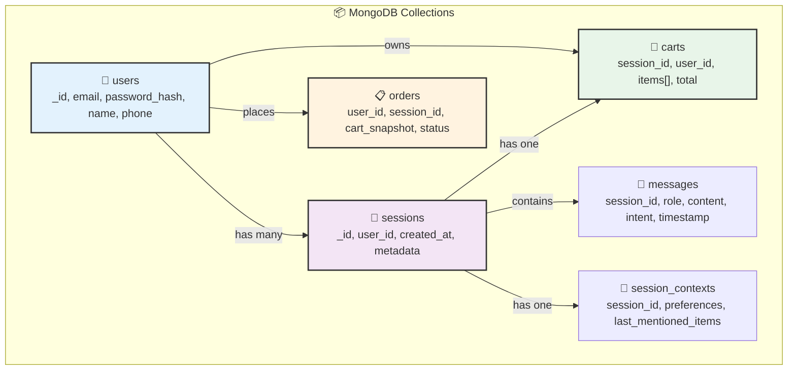
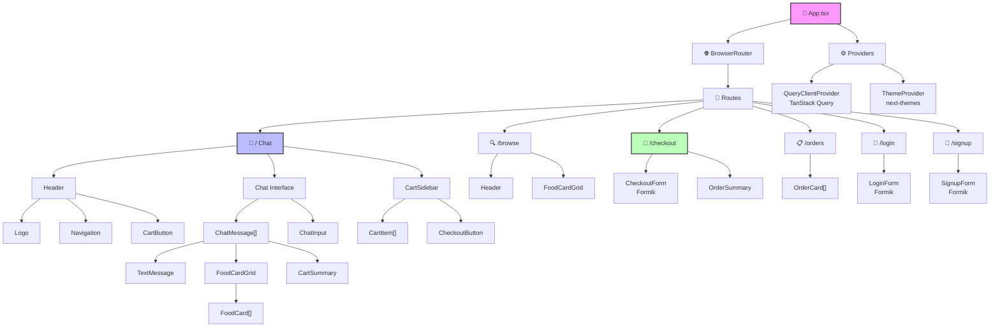
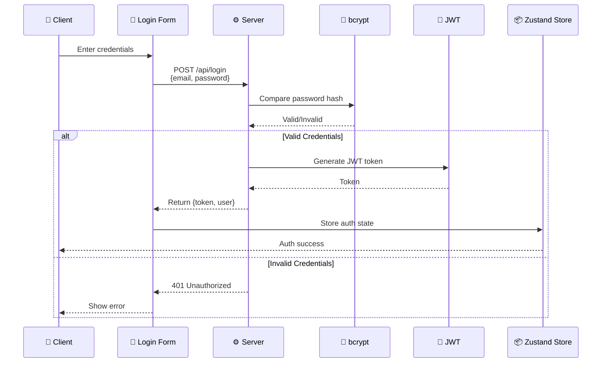
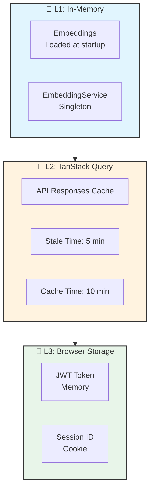

# AI-Powered Food Ordering System

An intelligent conversational food ordering platform with AI-powered recommendations, built with React, TypeScript, Node.js, and MongoDB.

## Quick Start (Docker Compose)

### 1. Create Environment Files

```bash
# Backend environment
cp backend/.env.example backend/.env

# Frontend environment
cp frontend/.env.example frontend/.env
```

Edit `backend/.env` and add your Gemini API key:
```env
GEMINI_API_KEY=your-gemini-api-key-here
```

### 2. Run with Docker Compose

```bash
docker compose up -d
```

The application will be available at:
- Frontend: http://localhost:3000
- Backend API: http://localhost:5200

### 3. Stop the Application

```bash
docker compose down
```

---

## Technical Requirements Document (TRD)

### 1. System Architecture



### 2. Database Schema (MongoDB)

#### Collections

| Collection | Purpose | Key Fields |
|------------|---------|------------|
| **users** | Registered user accounts | `_id`, `email`, `password_hash`, `name`, `phone`, `created_at` |
| **sessions** | Conversation sessions | `_id`, `user_id` (nullable), `created_at`, `last_message_at`, `metadata` |
| **messages** | Chat history | `_id`, `session_id`, `role`, `content`, `intent`, `filters`, `results`, `timestamp` |
| **session_contexts** | Conversation state | `session_id`, `last_mentioned_items`, `last_search_query`, `preferences`, `cart_id`, `updated_at` |
| **carts** | Shopping carts | `_id`, `session_id`, `user_id`, `items[]`, `created_at`, `updated_at` |
| **orders** | Completed orders | `_id`, `user_id`, `session_id`, `cart_snapshot`, `customer_info`, `total`, `status`, `payment_method`, `created_at` |

#### Schema Relationships



#### Indexes

```javascript
// Performance indexes
db.users.createIndex({ email: 1 }, { unique: true });
db.sessions.createIndex({ user_id: 1 });
db.messages.createIndex({ session_id: 1, timestamp: -1 });
db.carts.createIndex({ session_id: 1 });
db.carts.createIndex({ user_id: 1 });
db.orders.createIndex({ user_id: 1, created_at: -1 });
```

### 3. AI/ML Architecture

#### 3.1 Intent Extraction Flow


#### 3.2 Hybrid Search Algorithm


#### 3.3 AI Models Configuration

| Model | Purpose | Parameters |
|-------|---------|------------|
| **gemini-embedding-001** | Text embeddings | 768 dimensions |
| **gemini-2.0-flash** | Intent extraction | Temperature: 0.1, Max tokens: 1024 |

### 4. API Design

#### 4.1 RESTful Endpoints

| Endpoint | Method | Auth | Description |
|----------|--------|------|-------------|
| `/api/health` | GET | No | Health check |
| `/api/auth/register` | POST | No | User registration |
| `/api/auth/login` | POST | No | User login |
| `/api/auth/me` | GET | Yes | Get current user |
| `/api/foods` | GET | No | Get all foods |
| `/api/foods/:id` | GET | No | Get food by ID |
| `/api/search` | POST | No | AI chat/search |
| `/api/search/:sessionId/history` | GET | No | Chat history |
| `/api/cart` | GET | No | Get cart |
| `/api/cart/items` | POST | No | Add to cart |
| `/api/cart/items/:id` | PUT | No | Update quantity |
| `/api/cart/items/:id` | DELETE | No | Remove item |
| `/api/cart` | DELETE | No | Clear cart |
| `/api/orders` | GET | Yes | Order history |
| `/api/orders` | POST | Yes | Create order |
| `/api/orders/:id` | GET | Yes | Order details |
| `/api/orders/:id/cancel` | POST | Yes | Cancel order |

#### 4.2 Request/Response Examples

**Search/Chat:**
```http
POST /api/search
Content-Type: application/json

{
  "message": "Show me spicy vegetarian curries",
  "sessionId": "optional-existing-session-id"
}

Response:
{
  "response": "Here are some spicy vegetarian curries!",
  "foods": [...],
  "sessionId": "sess_abc123",
  "intent": "recommend",
  "filters": { "vegetarian": true, "spiceLevel": "high" }
}
```

**Add to Cart:**
```http
POST /api/cart/items
Content-Type: application/json
Cookie: session_id=sess_abc123

{
  "foodId": "food_123",
  "quantity": 2
}

Response:
{
  "cart": {
    "id": "cart_456",
    "items": [...],
    "total": 798
  }
}
```

### 5. Frontend Architecture

#### 5.1 Component Hierarchy



#### 5.2 State Management

| Store | Technology | Purpose |
|-------|------------|---------|
| **Auth Store** | Zustand | User authentication state |
| **Cart Store** | Zustand | Shopping cart state |
| **Chat Store** | Zustand | Chat messages, session ID |
| **Server State** | TanStack Query | API data caching |

### 6. Security Architecture

#### 6.1 Authentication Flow



#### 6.2 Security Measures

| Layer | Implementation |
|-------|----------------|
| **Password Hashing** | bcrypt with salt rounds: 10 |
| **Token Signing** | JWT with HS256 algorithm |
| **Token Storage** | httpOnly cookies (backend) / memory (frontend) |
| **Session Management** | MongoDB-backed with UUID |
| **CORS** | Whitelist-based origins |
| **Input Validation** | Yup schemas on frontend, manual validation on backend |
| **NoSQL Injection** | Input sanitization and schema validation |

### 7. Performance Considerations

#### 7.1 Optimizations

| Area | Strategy | Implementation |
|------|----------|----------------|
| **Database** | Connection pooling | MongoDB native driver with connection pooling |
| **Search** | Pre-computed embeddings | JSON file caching |
| **Images** | CDN delivery | ImageKit integration |
| **Frontend** | Code splitting | Vite dynamic imports |
| **State** | Selective subscriptions | Zustand shallow equality |
| **API** | Response caching | TanStack Query stale-while-revalidate |

#### 7.2 Caching Strategy



### 8. Deployment Architecture

#### 8.1 Docker Configuration

```yaml
# docker-compose.yml
services:
  backend:
    build: ./backend
    ports: ["5200:5200"]
    env_file:
      - ./backend/.env
    restart: unless-stopped
      
  frontend:
    build: ./frontend
    ports: ["3000:80"]
    depends_on: [backend]
    restart: unless-stopped
```
