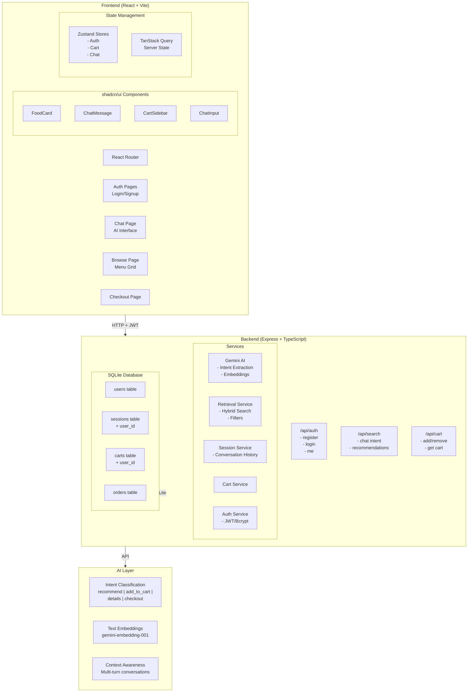

# AI Food Ordering System - Implementation Plan

## System Architecture



## Tech Stack Summary

| Layer | Technology |
|-------|------------|
| Frontend | React 19, TypeScript, Vite |
| UI Components | shadcn/ui (light mode) |
| Styling | Tailwind CSS 4 |
| State (Client) | Zustand |
| State (Server) | TanStack Query |
| Routing | React Router v7 |
| Backend | Express, TypeScript |
| Database | SQLite (better-sqlite3) |
| AI | Google Gemini API |
| Auth | JWT + bcrypt |
| Container | Docker + Docker Compose |

## Key Features

### 1. Authentication Flow
- Guest users can chat and add to cart
- Login/signup required for checkout
- JWT tokens stored in memory (secure)
- Conversations linked to user after login

### 2. AI Chat Experience
- Intent extraction (Gemini Flash)
- Multi-turn conversation context
- Reference resolution ("that", "first one")
- Dynamic UI components in chat

### 3. Search & Recommendations
- Hybrid search: semantic + keyword + filters
- Fallback strategies when no results
- Filter by: category, protein, carbs, vegetarian, spice, budget

### 4. Cart & Checkout
- Guest cart persists in session
- User cart linked to account
- Delivery form with validation
- Cash on delivery payment

## Database Schema Updates

```sql
-- Users table (new)
CREATE TABLE users (
    id TEXT PRIMARY KEY,
    email TEXT UNIQUE NOT NULL,
    password_hash TEXT NOT NULL,
    name TEXT NOT NULL,
    phone TEXT,
    created_at INTEGER NOT NULL
);

-- Update sessions table
ALTER TABLE sessions ADD COLUMN user_id TEXT REFERENCES users(id);

-- Update carts table
ALTER TABLE carts ADD COLUMN user_id TEXT REFERENCES users(id);

-- Orders table (new)
CREATE TABLE orders (
    id TEXT PRIMARY KEY,
    user_id TEXT NOT NULL REFERENCES users(id),
    session_id TEXT REFERENCES sessions(id),
    total_amount REAL NOT NULL,
    status TEXT DEFAULT 'pending',
    delivery_name TEXT,
    delivery_phone TEXT,
    delivery_address TEXT,
    delivery_instructions TEXT,
    created_at INTEGER NOT NULL
);
```

## API Routes

| Method | Route | Auth | Description |
|--------|-------|------|-------------|
| POST | /api/auth/register | Public | Create account |
| POST | /api/auth/login | Public | Login, get JWT |
| GET | /api/auth/me | Protected | Get current user |
| POST | /api/search | Optional | Chat/search endpoint |
| GET | /api/cart | Optional | Get cart |
| POST | /api/cart/items | Optional | Add item |
| DELETE | /api/cart/items/:id | Optional | Remove item |
| POST | /api/orders | Protected | Create order |
| GET | /api/orders | Protected | Order history |

## Color Scheme (Light Mode)

```css
/* Primary - Warm Orange */
--primary: 24 95% 53%;        /* #f97316 */
--primary-foreground: 0 0% 100%;

/* Background - Creamy White */
--background: 40 33% 98%;       /* #fdfcf9 */
--foreground: 24 10% 10%;       /* #1c1917 */

/* Card - Pure White */
--card: 0 0% 100%;              /* #ffffff */
--card-foreground: 24 10% 10%;

/* Muted - Soft Beige */
--muted: 40 20% 95%;            /* #f5f2ed */
--muted-foreground: 24 10% 40%; /* #78716c */

/* Border - Light Gray */
--border: 40 20% 90%;           /* #e7e5e4 */
```

## Implementation Phases

1. **Phase 1**: Setup (shadcn, React Query, Zustand, Router)
2. **Phase 2**: Authentication (backend + frontend)
3. **Phase 3**: Chat UI components (shadcn)
4. **Phase 4**: Chat page with AI integration
5. **Phase 5**: Cart & checkout
6. **Phase 6**: Browse page
7. **Phase 7**: Backend user linking
8. **Phase 8**: Polish & documentation
9. **Phase 9**: Testing & demo video

## Restaurant Branding

Suggested name: **"SpiceRoute"** or **"Curry Garden"**

Tagline: "Discover flavors through conversation"

Logo concept: Chat bubble + spice/food icon
